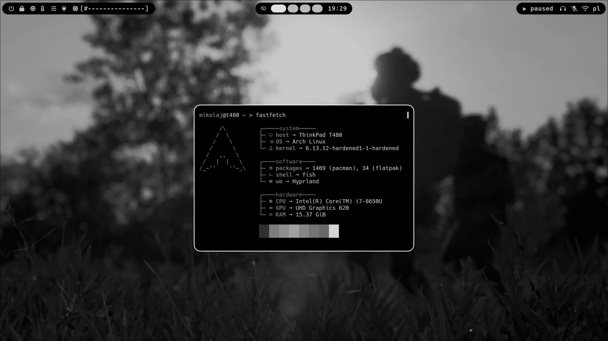

  
# Dotfiles

> While you are here, you might want to check out some of my themes that fit the style of this rice:
> - [gimp-carbon theme](https://github.com/tpaau-17DB/gimp-carbon)
> - [nvim-habamax theme](https://github.com/tpaau-17DB/habamax.nvim)

## My Setup

* **OS**: Arch Linux
* **Terminal**: Kitty
* **WM**: Hyprland
* **Bar**: Waybar
* **Font**: Hack Nerd Font
* **Launcher**: Wofi
* **Session Management**: Wlogout
* **Notifications**: Mako

## Credits

* Waybar, wofi, mako, hyprland and wlogout config files based on default [HyprV](https://github.com/soldoestech/hyprv4) config files 
